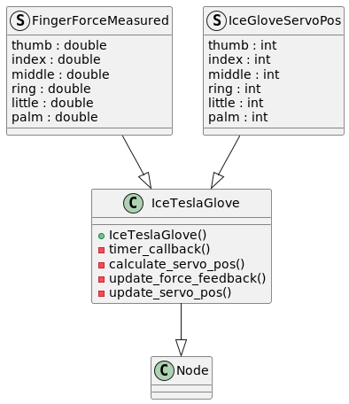

# IceTeslaGlove

A package for ROS2 control of the IceTeslaGlove. 
Simply launch the executable to launch the node, and control will be enabled.
For control og multiple gloved id have to be set individually. 
Support for multiple devices without code configurations will be added later.

## How to Use

## Package configuration

Below are the class diagram for the package shown. 

